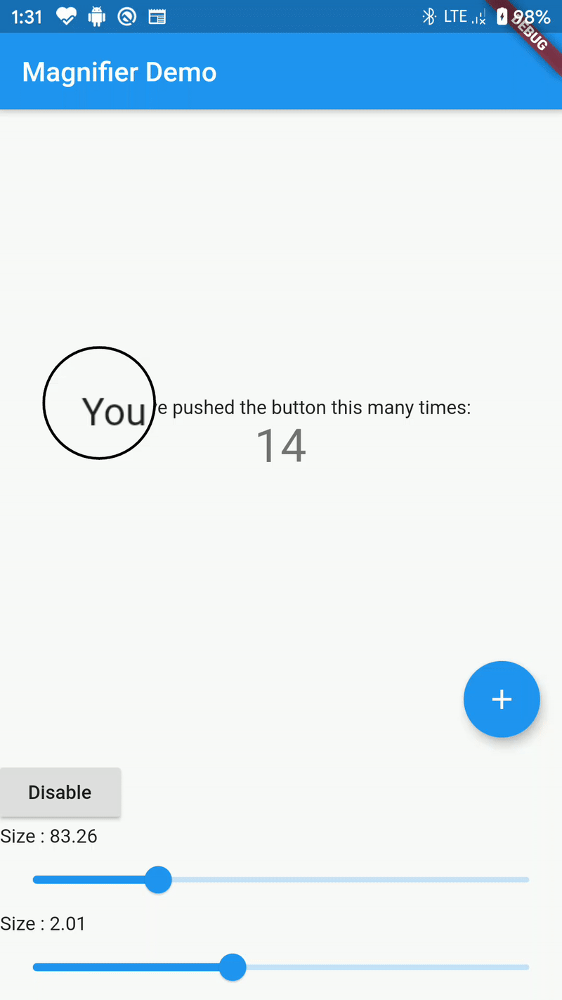

# magnifier

This Flutter Plugin allows you to add a Magnifying Glass 🔍 to you Application.

## Quickstart

```dart
void main() => runApp(MyApp());

class MyApp extends StatelessWidget {
  @override
  Widget build(BuildContext context) {
    return Magnifier(
        child: MaterialApp(
      title: 'Flutter Demo',
      home: MyHomePage(title: 'Flutter Demo Home Page'),
    ));
  }
}

```

## Demo

<p align="center">
  
</p>

## Properties

### `scale`

The amount by which the content below scaled in (Or Zoomed In).

Default Value ==> `1.2` (**double**)

### `size`

The size of the Magnifying Glass

Default Value ==> `Size(80,80)` (**Size**)

### Enabled

Weather or not to show the Magnifying Glass.

Default Value ==> `true` (**bool**)

## Limitations

The package currently **does not work on the web** because of a bug upstream.

Track it [here](https://github.com/flutter/flutter/issues/45213).
